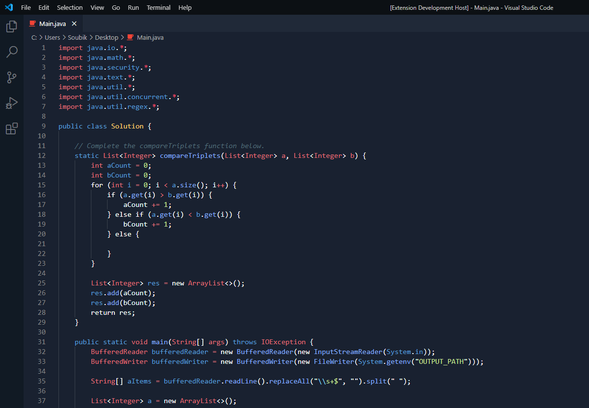
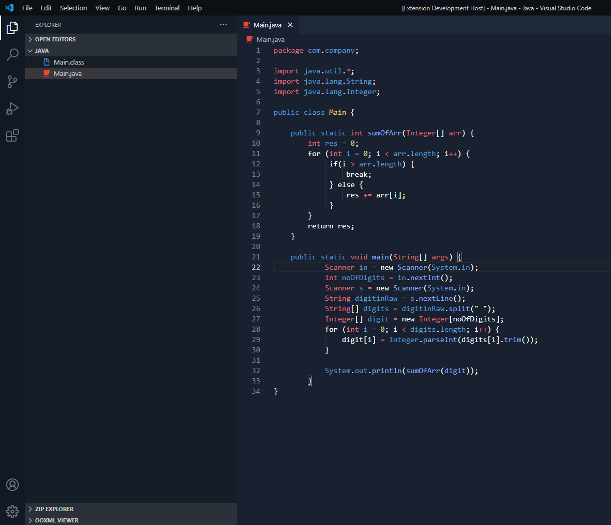
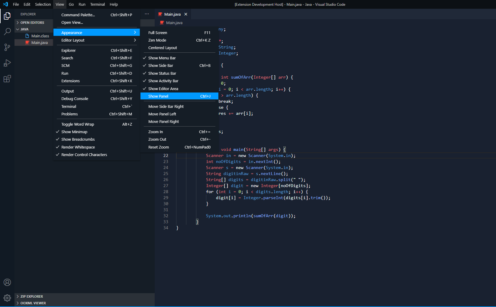
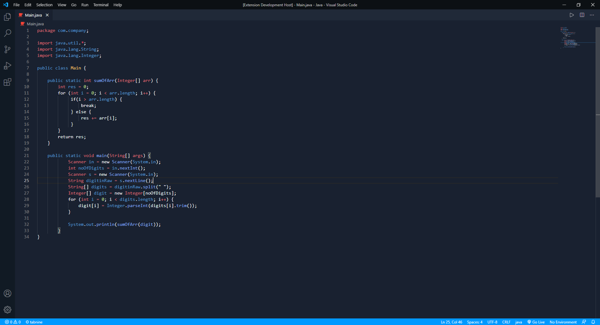
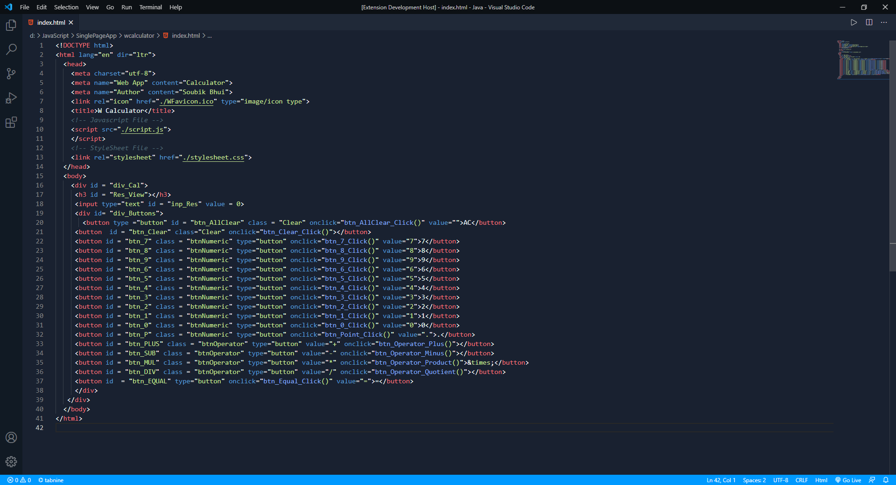

<p align="center">

</p>
<div style="align-items:center">
<h1 style="font-size: 70px; text-align:center">HR Dark</h1>

<h2 style="font-size: 35px; text-align: center">HackerRank Dark Theme For Visual Studio Code</h2>
</div>

##### HR Dark is a VSCode Theme Extension which use red, blue and green as its main syntax colors

### Usage

```
File -> Preferences -> Color Theme -> HR Dark
```



###### Side Bar



###### Menu



<center><h2 style="font-size: 40px">Gallery</h2></center>

#### Java



#### HTML



#### JSON


#### To Clone This Repository

###### Open up your terminal and write the following command

      git clone

#### CHANGELOG

###### For Updates and Previous Releases check out the [CHANGELOG.md](./CHANGELOG.md) file

#### License

###### Check out the [License](./LICENSE) file
